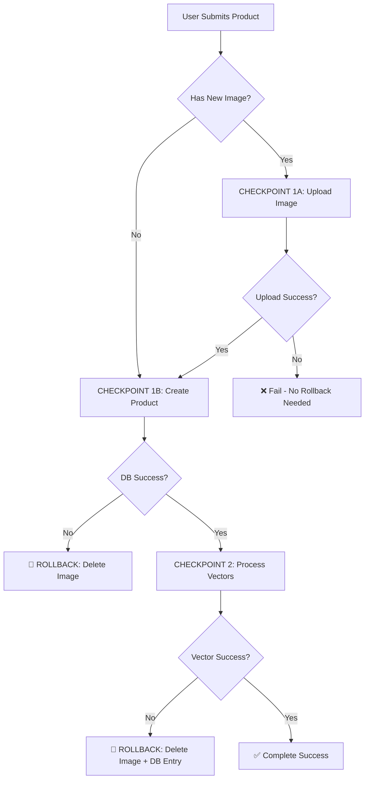

# 📸 Catalog Image Rollback Enhancement

## **Problem Identified**
The catalog tab was missing a critical rollback checkpoint for product image uploads. The previous flow was:

1. **Frontend**: User uploads image → `/api/upload/image` → Gets image URL
2. **Frontend**: User creates product with image URL → `/api/catalog/products`
3. **Issue**: If step 2 failed, the image from step 1 was orphaned in storage

## **Solution Implemented**

### **New Integrated Flow**
1. **Frontend**: User selects image and product details
2. **Frontend**: Sends multipart form data to product creation API
3. **Backend**: CHECKPOINT 1A: Upload image to storage
4. **Backend**: CHECKPOINT 1B: Create product in database  
5. **Backend**: CHECKPOINT 2: Process vectors
6. **On Failure**: Complete rollback including image deletion

### **Technical Changes**

#### **Backend API Updates** (`app/api/knowledge-sources/[sourceId]/catalog/products/route.ts`)

1. **Added multipart form data support**:
   ```typescript
   // Handle both multipart (with image) and JSON (without image)
   const contentType = request.headers.get('content-type') || '';
   if (contentType.includes('multipart/form-data')) {
     // Extract image file and product data
     imageFile = formData.get('image') as File;
   }
   ```

2. **Added image upload checkpoint**:
   ```typescript
   // CHECKPOINT 1A: IMAGE UPLOAD (if new image provided)
   if (imageFile) {
     const uploadedImageUrl = await handleImageUpload(imageFile, session.user.id, rollback);
     product.imageUrl = uploadedImageUrl;
   }
   ```

3. **Added image validation and rollback tracking**:
   ```typescript
   async function handleImageUpload(file: File, userId: string, rollback: any) {
     // Validate file type and size
     const uploadResult = await uploadToSupabase(file, 'products', 'catalog', userId);
     rollback.recordBucketSuccess(uploadResult.url); // Track for rollback
     return uploadResult.url;
   }
   ```

#### **Frontend Updates** (`components/knowledge-base/catalog/manual-mode.tsx`)

1. **Removed separate image upload**:
   - Eliminated `uploadImageToSupabase()` function
   - Removed intermediate image upload step

2. **Added multipart form data support**:
   ```typescript
   if (selectedImage && session?.user?.id) {
     // Use multipart form data for new image upload
     const formData = new FormData();
     formData.append('image', selectedImage);
     formData.append('product', JSON.stringify(productData));
   } else {
     // Use JSON for existing image URL or no image
     // Send JSON payload
   }
   ```

### **Rollback Flow**



### **Benefits**

✅ **No Orphaned Images**: Failed product creation automatically cleans up uploaded images  
✅ **Atomic Operations**: All-or-nothing approach prevents partial states  
✅ **Better UX**: Single operation instead of separate upload + creation  
✅ **Consistent Patterns**: Matches other tabs' rollback implementations  
✅ **Storage Efficiency**: No wasted storage from failed operations  

### **Validation**

The enhanced catalog tab now provides the same level of rollback protection as other tabs:

- **File Tab**: Bucket → DB → Vector ✅
- **Text Tab**: DB → Vector ✅  
- **QA Tab**: DB → Vector ✅
- **Website URL Tab**: DB ✅
- **Website Crawler Tab**: Bucket → DB → Vector ✅
- **Catalog Tab**: **Image → DB → Vector** ✅ *(Enhanced)*

---

**Status**: ✅ **COMPLETE** - Catalog tab now has comprehensive rollback protection including image uploads. 