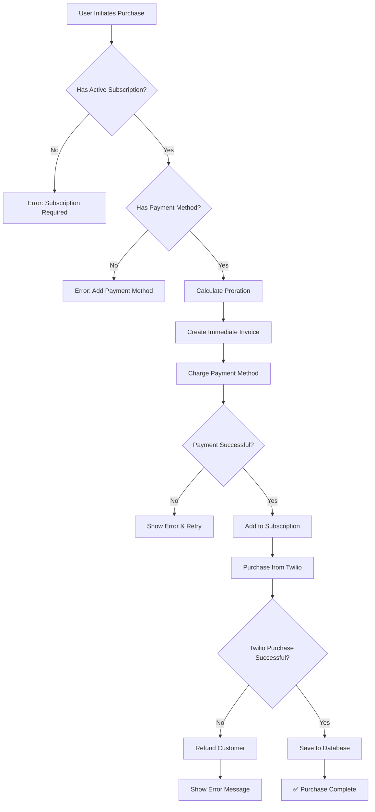

# Phone Number Billing System

## Overview

The phone number purchase system integrates seamlessly with the main subscription, creating a unified billing experience where phone numbers are add-ons to the primary subscription rather than separate subscription items.

## Key Features

### 1. **Single Subscription Model**
- Phone numbers are add-ons to the main subscription
- All billing consolidated into one monthly invoice
- Phone number costs added to the user's primary subscription

### 2. **Prorated Billing**
- Users are charged a prorated amount for the current billing period when purchasing
- Prorated amount calculated based on days remaining in the current billing cycle
- Immediate invoice created and paid for the prorated amount
- Full monthly cost added to subscription starting next billing cycle

### 3. **Dynamic Pricing**
- Phone number prices determined dynamically based on country
- System adds markup to Twilio's base price
- Prices stored as Stripe Price objects for consistent billing

## Purchase Flow

### User Experience
1. **Search for Phone Number** → User searches for available phone numbers
2. **Select Number** → User selects desired phone number
3. **Checkout Process**:
   - System verifies active subscription
   - System verifies payment method exists
   - If no payment method: Shows error with option to add payment method
   - If payment method exists: Shows purchase confirmation
4. **Purchase Confirmation**:
   - Shows prorated charge for current period
   - Shows monthly recurring cost
   - Displays next billing date
5. **Complete Purchase**:
   - Immediate charge for prorated amount
   - Phone number provisioned in Twilio
   - Number added to subscription as recurring charge

### Technical Flow



## API Endpoint

### Main Endpoint: `/api/twilio/phone-numbers`

**Method**: POST

**Request Body**:
```json
{
  "phoneNumber": "+1234567890",
  "country": "US",
  "selectedAgentId": "optional-agent-id"
}
```

**Response**:
```json
{
  "success": true,
  "message": "Phone number purchased successfully and added to your subscription!",
  "phoneNumber": {
    "id": "phone-number-id",
    "number": "+1234567890",
    "monthlyPrice": "$6.25",
    "status": "active",
    "proratedCharge": "$3.12",
    "nextBillingAmount": "$6.25",
    "renewalDate": "2025-06-30"
  }
}
```

## Database Schema

### TwilioPhoneNumber Model
- `metadata` field (JSONB) stores purchase details, pricing info, etc.
- `subscriptionItemId` field is optional (for legacy support)
- Phone numbers no longer require separate subscription items

### Invoice Model
- Tracks phone number purchases with proper references
- Records immediate prorated charges

## Billing Details

### Immediate Charges
- Prorated amount: `(monthly_price * days_remaining / total_days_in_period)`
- Invoice created: `Phone Number {number} - Prorated charge`
- Payment processed immediately

### Recurring Charges
- Phone numbers grouped by price as subscription add-ons
- Multiple numbers at same price share one subscription item with quantity
- Monthly invoice shows: `Phone Number Add-on ($X.XX/month) × quantity`

### Refund Handling
- Automatic refund if Twilio purchase fails after payment
- Refund metadata includes reason and phone number
- Manual intervention logged for critical failures

## Benefits

1. **Simplified Billing**: One subscription, one invoice, one payment
2. **Better UX**: No multiple subscriptions to manage
3. **Cleaner Database**: Less subscription item clutter
4. **Easier Upgrades**: Phone numbers scale with subscription
5. **Consistent Experience**: Matches main subscription billing cycle

## Migration Notes

### For Existing Phone Numbers
- Legacy phone numbers with `subscriptionItemId` continue to work
- Can run migration script to consolidate into main subscription
- No action required - backward compatible

### For New Implementations
- Always use `/api/twilio/phone-numbers` endpoint
- Ensure user has active subscription before allowing purchase
- Handle `requiresPaymentMethod` response to guide users

## Error Handling

### Common Error Scenarios
1. **No Active Subscription**: Direct user to subscribe to a plan
2. **No Payment Method**: Show error with link to add payment method
3. **Phone Number Unavailable**: Show clear message and suggest alternatives
4. **Payment Failed**: Allow retry with different payment method
5. **Twilio Error**: Automatic refund and support notification

### Error Response Format
```json
{
  "success": false,
  "error": "Human-readable error message",
  "requiresPaymentMethod": true, // Optional flag
  "refunded": true // Optional flag
}
```

## Testing

### Test Scenarios
1. Purchase with existing payment method
2. Purchase requiring new payment method
3. Purchase with proration calculation
4. Failed Twilio purchase (with refund)
5. Multiple phone numbers at same price
6. Phone numbers at different prices

### Debug Commands
```bash
# Check user's phone numbers and billing
node scripts/debug-phone-billing.js user@example.com

# Verify subscription add-ons
node scripts/check-subscription-addons.js user@example.com
```

## Future Enhancements

1. **Bulk Purchases**: Buy multiple numbers at once
2. **Number Porting**: Port existing numbers
3. **Regional Pricing**: Show prices in local currency
4. **Usage-Based Pricing**: Option for pay-per-use instead of monthly
5. **Number Categories**: Premium, toll-free, local numbers

---

*This billing system ensures a seamless experience for users while maintaining clean code and database structure.* 