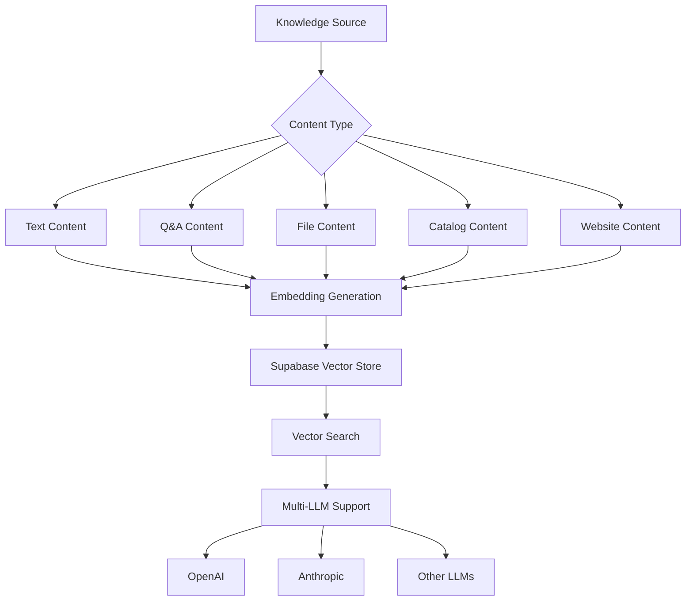

# Supabase Vector Store Migration Guide

## Overview

This guide provides a comprehensive plan to migrate your knowledge base from OpenAI vector stores to Supabase vector stores, enabling support for multiple LLM providers while maintaining your existing functionality.

## Architecture Overview



## Implementation Status

### ✅ Completed

1. **Core Infrastructure**
   - Created `lib/supabase-vector-service.ts` - Main service for Supabase vector operations
   - Created `lib/vector-store-adapter.ts` - Adapter layer for seamless transition
   - Created `supabase/migrations/20240120_vector_store_setup.sql` - Database migration
   - Created `supabase/functions/process-embeddings/index.ts` - Edge function for embedding generation

2. **Database Schema Updates**
   - Added vector storage columns to Prisma schema
   - Created centralized vector documents table
   - Added embedding configuration fields to knowledge sources

3. **Migration Tools**
   - Created `scripts/migrate-to-supabase-vectors.ts` - Migration script
   - Implemented feature flags for gradual rollout

### 🚧 Required Next Steps

## Step 1: Update Environment Variables

Add the following to your `.env` file:

```bash
# Supabase Configuration
SUPABASE_SERVICE_ROLE_KEY=your-service-role-key
USE_SUPABASE_VECTORS=false  # Set to true when ready to use Supabase vectors

# Optional: Change embedding provider (default is OpenAI)
EMBEDDING_PROVIDER=openai
EMBEDDING_MODEL=text-embedding-3-small
```

## Step 2: Run Database Migrations

1. **Generate Prisma Client** (to fix TypeScript errors):
```bash
npx prisma generate
```

2. **Push schema changes to database**:
```bash
npx prisma db push
```

3. **Run Supabase migration**:
```bash
# If using Supabase CLI
supabase db push

# Or run the SQL migration directly in Supabase dashboard
# Copy contents from: supabase/migrations/20240120_vector_store_setup.sql
```

## Step 3: Deploy Edge Function

```bash
# Deploy the embedding processing function
supabase functions deploy process-embeddings --no-verify-jwt

# Set the OpenAI API key for the edge function
supabase secrets set OPENAI_API_KEY=your-openai-api-key
```

## Step 4: Update Package Scripts

Add to your `package.json`:

```json
{
  "scripts": {
    "migrate:vectors": "tsx scripts/migrate-to-supabase-vectors.ts",
    "migrate:vectors:dry": "tsx scripts/migrate-to-supabase-vectors.ts -- --dry-run"
  }
}
```

## Step 5: Update Existing Code

### Replace imports in your content management files:

**Before:**
```typescript
import { processContentToVectorStore } from '@/lib/knowledge-vector-integration';
```

**After:**
```typescript
import { processContentToVectorStore } from '@/lib/vector-store-adapter';
```

### Example for Text Content:

```typescript
// In your text content API route
import { processContentToVectorStore } from '@/lib/vector-store-adapter';

// When adding/updating content
await processContentToVectorStore(
  knowledgeSourceId,
  { content: textContent, userId: session.user.id },
  'text',
  newTextContent.id
);
```

## Step 6: Migrate Existing Content

1. **Test with dry run**:
```bash
npm run migrate:vectors:dry
```

2. **Migrate all knowledge sources**:
```bash
npm run migrate:vectors
```

3. **Migrate specific knowledge source**:
```bash
npm run migrate:vectors -- --source-id <knowledge-source-id>
```

## Step 7: Enable Supabase Vectors

Once migration is complete and tested:

1. Set environment variable:
```bash
USE_SUPABASE_VECTORS=true
```

2. Restart your application

## Key Features

### Multi-LLM Support

The new system supports multiple embedding providers:

```typescript
// Configure in database per knowledge source
embeddingProvider: 'openai' | 'cohere' | 'custom'
embeddingModel: 'text-embedding-3-small' // or any supported model
embeddingDimensions: 1536 // adjust based on model
```

### Automatic Embedding Generation

- Uses pgmq for queuing
- Processes embeddings asynchronously
- Handles retries automatically
- Supports batch processing

### Vector Search

```typescript
// Search across knowledge sources
const results = await searchKnowledgeSource(
  knowledgeSourceId,
  'search query',
  {
    limit: 10,
    threshold: 0.7,
    contentTypes: ['text', 'qa'] // optional filtering
  }
);
```

## Troubleshooting

### Common Issues

1. **TypeScript Errors**: Run `npx prisma generate` after schema changes
2. **Migration Fails**: Check Supabase logs and ensure all extensions are enabled
3. **Edge Function Errors**: Verify environment variables are set correctly

### Monitoring

- Check embedding job status in `embedding_job_status` table
- Monitor Edge Function logs in Supabase dashboard
- Track vector store updates via `vectorStoreUpdatedAt` timestamp

## Benefits

1. **LLM Independence**: Not locked into OpenAI's ecosystem
2. **Cost Optimization**: Use cheaper embedding models
3. **Performance**: Local vector search is faster
4. **Flexibility**: Custom embedding strategies per content type
5. **Scalability**: Better control over indexing and search

## Support

For issues or questions:
1. Check Supabase vector documentation
2. Review the migration script output
3. Examine Edge Function logs
4. Contact support with specific error messages 